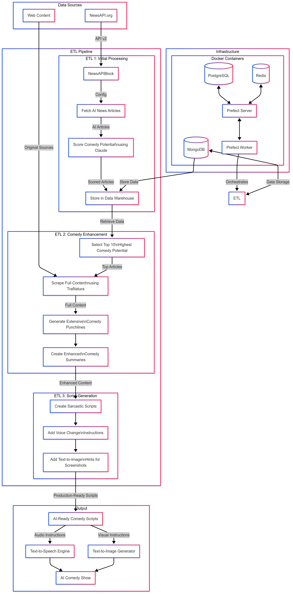

# AI News Comedy Processing System

## Overview

This document describes the architecture and functionality of our AI News Comedy Processing System, an automated pipeline designed to transform news articles about artificial intelligence into comedy content suitable for AI-driven presentation.

## System Purpose

The primary objective of this system is to automate the creation of comedy scripts from AI-related news articles. The system performs a series of transformations, from initial article selection and comedy potential evaluation through to the generation of production-ready comedy scripts with voice modulation instructions and visual cues.

## Technical Architecture

### Infrastructure Components

The system operates within a containerized Docker environment consisting of:

- **PostgreSQL**: Relational database supporting Prefect workflow orchestration
- **Redis**: In-memory data store for Prefect task coordination
- **MongoDB**: Document database serving as the primary data warehouse for articles and processing results
- **Prefect Server**: Orchestration control plane for managing workflow execution
- **Prefect Worker**: Execution environment for ETL workflows, with direct access to project code mounted from the host system

### Data Sources

The system ingests data from:

- **NewsAPI.org**: External API providing access to a wide range of news articles filtered by topic (artificial intelligence)
- **Original Web Content**: Raw article content retrieved via web scraping for enhanced processing

## ETL Pipeline

The data processing occurs in three sequential ETL workflows:

### ETL 1: Initial Article Processing

This initial pipeline:
- Utilizes a custom `NewsAPIBlock` to interface with the NewsAPI
- Fetches articles related to artificial intelligence, sorted by popularity
- Processes each article with Claude LLM to evaluate its comedy potential
- Stores the evaluated articles with their comedy scores in MongoDB

### ETL 2: Content Enhancement

The second pipeline:
- Selects the top 10 articles with the highest comedy potential
- Employs Trafilatura to scrape full article content from the original sources
- Performs extensive comedy analysis and enhancement
- Generates comedy punchlines and summaries
- Prepares structured data for final script generation

### ETL 3: Production Script Creation

The final pipeline:
- Transforms enhanced content into complete sarcastic comedy scripts
- Embeds voice modulation instructions to guide text-to-speech conversion
- Incorporates visual cues and context hints for text-to-image AI generation
- Produces production-ready scripts formatted for multi-modal AI presentation

## Output and Intended Use

The system outputs:
- Fully-formed comedy scripts with embedded presentation instructions
- Assets ready for consumption by text-to-speech engines
- Visual prompt guidelines for text-to-image AI generation

These outputs collectively enable the creation of a synthetic comedy presentation about artificial intelligence news, delivered by AI voice synthesis and accompanied by AI-generated imagery.

## Implementation Notes

All ETL processes are orchestrated by Prefect, ensuring reliable execution, dependency management, and monitoring. MongoDB serves as the central data repository, maintaining state throughout the pipeline. The modular architecture allows for future expansion, such as adding new content sources or output formats.